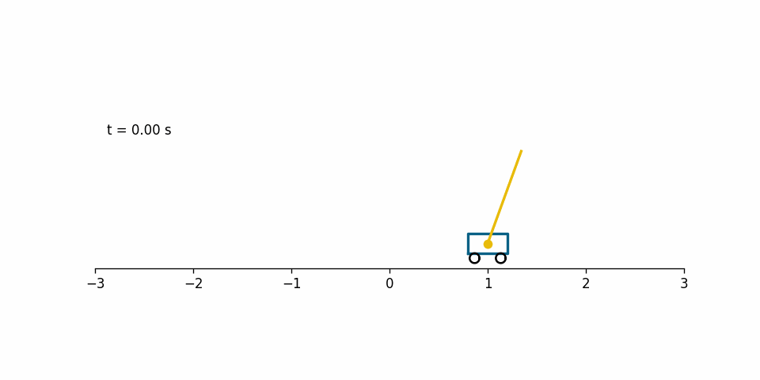
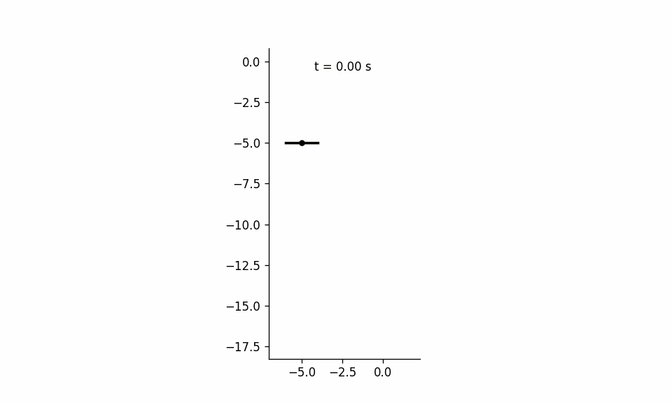

# Frugal Inference for Control

**Balancing task performance, motion effort, and information usage in partially observed environments where:**

* the information distilled from previous evidence is considered a resource the agent must manage efficiently
* inference is a meta-regulated process rather than a fixed subroutine
* state and action spaces are continuous
* transitions are stochastic linear dynamics corrupted by Gaussian noise
  
---
## Features
- 📦 Python package `frugal_rationality` for easy reuse.
- 📓 Example Jupyter notebooks to demonstrate usage.
- 🧪 Ready for experimentation and extension.
---

## Quick Start
### 1. Clone the repository
```bash
git clone https://github.com/ItzelCoral/Frugal_Rationality.git
cd Frugal_Rationality
```````

### 2. Set up a virtual environment ⚠️ Requires Python 3.9
```bash
python3 -m venv .venv
source .venv/bin/activate   # macOS/Linux
.venv\Scripts\activate      # Windows
```````

### 3. Install dependencies and package
⚙️ Install tensorflow 2.19 and keras 3.10 (instructions vary based on your computer's architecture)
```bash
pip install -r requirements.txt     # Install remaining dependencies
pip install -e .                    # Install the package frugal_rationality
```````

### 4. Run the notebooks to:
   * Balance a pole on a moving cart using frugal inference 
   * Stabilize a planar quadrotor using frugal inference 

---
## Project Structure
```bash
Frugal_Rationality/
│── frugal_rationality/          # Python package
│   ├── __init__.py              
│   └── LQG_control.py           # Optimal solution when information is free
│   └── nonlinear_simulation.py  # Simulator
│   └── numerical_solver.py      # Meta-cognitive POMDP solver
│   └── visualizer.py            # Auxiliary functions for visualization and rendering purposes
│── notebooks/                   # Example Jupyter notebooks
│   ├── cart_pole_demo.ipynb
│   └── planar_drone_demo.ipynb
│── render_demos/                # Gif animations showing optimized performance
│   ├── cart_pole.gif
│   └── drone.gif
│── solutions/                   # Frugal strategies balancing task performance, motion effort, and info usage
│   ├── cart_pole.npy
│   └── drone.npy
│── requirements.txt             # Dependencies
│── README.md                    # Project documentation
│── LICENSE                      # License file
```````
---
## Contributing
Contributions, issues, and feature requests are welcome!
To contribute:
1. Fork the repository
2. Create a feature branch (`git checkout -b feature/my-feature`)
3. Commit your changes (`git commit -m "Add new feature"`)
4. Push to your branch (`git push origin feature/my-feature`)
5. Open a Pull Request 🎉
